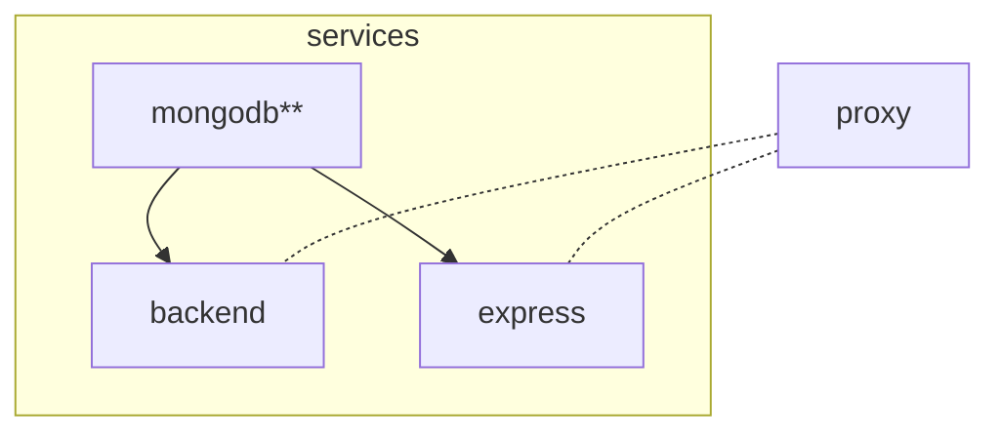

# SciCat Mini (HTW Copy)

Files for running SciCat with docker-compose. This code was cloned from the orginial repo.
We limit the modules to the V4 backend, the mongodb, the mongo express and soon the 
oai-pmh interface.

## Steps

1. Clone the repository
   ```sh
   git clone https://github.com/PatrickFuhrmann-HTWBerlin/scicatlive-mini.git
   ```
2. Run with the following command inside the directory
   ```sh
   docker-compose up -d
   ```

## Default setup

Other than the original scicatlive from Carlo, this version only does the following:

By running `docker-compose up -d` these steps take place:
1. a [mongodb**](./services/mongodb/) container is created with some intial data.
2. a [mongo express**](./services/view/) is created connecting to the mongodb module.
3. the SciCat [backend v4*](./services/backendv4/) container is created and connected to (1).
4. a reverse [proxy](./services/proxy) container is created and routes traffic to (2) and (3) through localhost subdomains, in the form: `http://${service}.localhost` (for the ones of need). The frontend is available at simply `http://localhost`.

Here below we show the dependencies (if `B` depends on `A`, then we visualize as `A --> B`):



We flag with `*` the services which have extra internal dependencies, which are not shared across the two backend versions, and with `**` the ones which have an explicit dependency on the `BE_VERSION` value. To view them, refer to the service README.

## Select the services

The user can selectively decide the containers to spin up and the dependencies will be resolved accordingly. The available services are in the [services](./services/) folder and called consistently.

For example, one could decide to only run the `backend` by running (be aware that this will not run the `proxy`, so the service will not be available at `backend.localhost`):

```sh
docker-compose up -d backend
```

(or a list of services, for example, with the proxy `docker-compose up -d backend proxy`)

This will run, from the [previous section](#default-setup), (1) and (2) but skip the rest.

Accordingly,
```sh
docker-compose up -d frontend
```

Will run, from the [previous section](#default-setup), (1), (2) and (3) but skip (4) and (5).

And 

```sh
docker-compose up -d searchapi
```

Will run, from the [previous section](#default-setup), (1), (2) and (4) but skip (3) and (5).


## Custom configure a service

Every service folder (inside the [services](./services/) parent directory) contains its configuration and some instructions, at least for the non third-party containers.

For example, to configure the [frontend](./services/frontend/), the user can change any file in the [frontend config](./services/frontend/config/) folder, for which instructions are available in the [README](./services/frontend/README.md) file.

After any configuration change, `docker-compose up -d` must be rerun, to allow loading the changes.

## Add a new service

To add a new service (see the [backend v4](./services/backendv4/) for an extensive example):
1. create a dedicated folder in the [services](./services/) one
2. name it as the service
3. create the `docker-compose.yaml` file with the required dependencies (if any)
4. eventually include any service in (3) which is specific to the service and not shared across the global setup
5. eventually add the condition on the backend version (e.g. [here](./services/frontend/docker-compose.yaml#L14))
6. eventually create a `config` folder if it requires configuration
7. eventually add a `README.md` file in the service
8. include the reference to (3) to the global [docker-compose include list](docker-compose.yaml#L2)
9. eventually update the main [README.md](README.md)

## General use of SciCat

To use SciCat, please refer to the [original documentation](https://scicatproject.github.io/documentation/)
